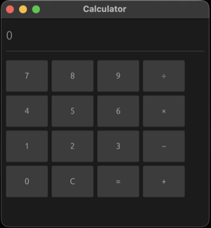

# rust_calc

A simple desktop calculator built with Rust and [egui](https://github.com/emilk/egui) via [eframe](https://github.com/emilk/egui/tree/master/crates/eframe).

The display shows the entire math expression as you build it (e.g. `12 + 7 * 3`), with correct operator precedence (`*` and `/` before `+` and `-`). Pressing `=` evaluates and shows the result; `C` resets everything.

<div align="center">



</div>

## Features

- Addition, subtraction, multiplication, division
- Correct operator precedence (no external parser — evaluated in two passes)
- Live expression display — see the full expression before evaluating
- Division-by-zero protection
- Clean, uniform button grid (4 × 4)

---

## Development

### Prerequisites

| Requirement | Version |
|---|---|
| [Rust toolchain](https://rustup.rs/) | stable (1.57+) |
| C linker (`cc`) | system default |
| X11 dev libraries (Linux only) | see below |

**Linux** — install the required X11/XCB development libraries once:

```bash
sudo apt-get install -y libxcb-shape0-dev libxcb-xfixes0-dev
```

**macOS / Windows** — no extra system libraries are needed.

### Clone and run

```bash
git clone https://github.com/your-username/rust_calc.git
cd rust_calc

# Debug build (fast compile, slower runtime)
cargo run

# Release build (optimised)
cargo run --release
```

### Build only

```bash
cargo build --release
# Binary is placed at:
#   Linux/macOS:  target/release/rust_calc
#   Windows:      target\release\rust_calc.exe
```

---

<!--
## Deployment

Pre-built release binaries are attached to each [GitHub Release](https://github.com/your-username/rust_calc/releases/latest):

| Platform | Download |
|---|---|
| Ubuntu / Debian (x86_64) | [rust_calc-linux-x86_64](https://github.com/your-username/rust_calc/releases/latest/download/rust_calc-linux-x86_64) |
| macOS (Apple Silicon) | [rust_calc-macos-aarch64](https://github.com/your-username/rust_calc/releases/latest/download/rust_calc-macos-aarch64) |
| macOS (Intel) | [rust_calc-macos-x86_64](https://github.com/your-username/rust_calc/releases/latest/download/rust_calc-macos-x86_64) |
| Windows (x86_64) | [rust_calc-windows-x86_64.exe](https://github.com/your-username/rust_calc/releases/latest/download/rust_calc-windows-x86_64.exe) |

### Linux — make executable and run

```bash
chmod +x rust_calc-linux-x86_64
./rust_calc-linux-x86_64
```

### macOS — remove quarantine and run

```bash
chmod +x rust_calc-macos-aarch64
xattr -d com.apple.quarantine rust_calc-macos-aarch64
./rust_calc-macos-aarch64
```

### Windows

Double-click `rust_calc-windows-x86_64.exe` or run it from PowerShell:

```powershell
.\rust_calc-windows-x86_64.exe
```
-->

---

## License

MIT
